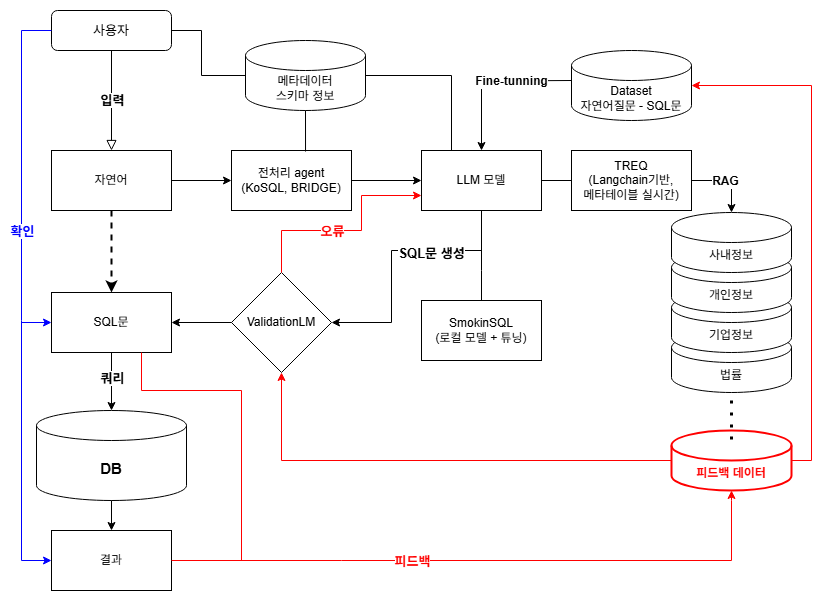

# KCB Text2SQL 프로젝트

신용평가기관 내에서 사용할 자연어를 SQL로 변환하는 프로젝트



## 🚀 주요 기능

### 1. 자연어 → SQL 변환
- OpenAI GPT 모델을 활용한 자연어를 SQL로 변환
- 로컬 LLM 지원 (Ollama, 기업용 LLM)
- 규칙 기반 폴백 시스템

### 2. 혼합 전처리 에이전트 (신규)
- **규칙 기반 + 딕셔너리 혼합 방식**: 신용평가 도메인 특화 딕셔너리와 규칙 기반 처리 결합
- **도메인 특화 딕셔너리**: 신용점수, 위험도, 대출, 연체 등 업무 용어 사전 구축
- **한국어 특화 자연어 처리**: jieba를 활용한 한국어 형태소 분석
- **절(Clause) 추출**: SELECT, WHERE, GROUP BY, ORDER BY 등 SQL 절 자동 추출
- **Chain of Thought 추론**: 단계별 추론 과정을 통한 정확한 SQL 생성
- **엔티티 추출**: 고객, 신용점수, 대출금액 등 도메인 엔티티 자동 추출
- **SQL 패턴 매핑**: 한국어 표현을 SQL 구문으로 자동 변환

### 3. 한국어 전처리 에이전트 (기존)
- **한국어 특화 자연어 처리**: jieba를 활용한 한국어 형태소 분석
- **절(Clause) 추출**: SELECT, WHERE, GROUP BY, ORDER BY 등 SQL 절 자동 추출
- **Chain of Thought 추론**: 단계별 추론 과정을 통한 정확한 SQL 생성
- **도메인 특화 처리**: 신용평가 도메인에 특화된 키워드 매핑
- **엔티티 추출**: 고객, 신용점수, 대출금액 등 도메인 엔티티 자동 추출

### 4. RAG (Retrieval-Augmented Generation)
- 문서 기반 컨텍스트 제공
- 도메인별 문서 관리 (개인신용, 기업신용, 정책규제)
- 벡터 데이터베이스 기반 유사도 검색

### 5. 동적 메타데이터 관리
- 엑셀 파일을 통한 스키마 업로드
- 실시간 메타데이터 적용
- 사용자 정의 테이블 구조 지원

## 📦 설치 및 실행

### 🚀 빠른 시작 (Windows)

#### 1. 전체 서버 한 번에 시작
```cmd
start_all.bat
```

#### 2. 개별 서버 시작
```cmd
# 백엔드만 시작
start_backend.bat

# 프론트엔드만 시작
start_frontend.bat
```

### 🔧 수동 설치 및 실행

#### 1. 사전 요구사항
- **Python 3.8+** 설치
- **Node.js 16+** 설치
- **Git** 설치

#### 2. 프로젝트 클론
```bash
git clone <repository-url>
cd KCB_text2sql_front
```

#### 3. 백엔드 설정
```bash
cd backend

# 가상환경 생성 및 활성화
python -m venv .venv
source .venv/bin/activate  # Linux/Mac
# 또는
.venv\Scripts\activate     # Windows

# 의존성 설치
pip install -r requirements.txt

# 환경 변수 설정
cp env.example .env
# .env 파일에서 API 키 설정

# 백엔드 실행
python -m api.app
```

#### 4. 프론트엔드 설정
```bash
cd frontend

# 의존성 설치
npm install

# 프론트엔드 실행
npm start
```

### 📝 접속 주소
- **백엔드 API**: http://localhost:5000
- **프론트엔드**: http://localhost:3000

## 🔧 혼합 전처리 에이전트 상세

### 구조
```
hybrid_preprocessing_agent.py
├── HybridPreprocessingAgent (메인 클래스)
├── 규칙 기반 처리 (정규화, 패턴 매칭)
├── 동적 딕셔너리 기반 매핑 (JSON 파일 기반)
├── 엔티티 추출기 (신용점수, 위험도, 대출 등)
├── 절(Clause) 추출기 (SQL 절 자동 분리)
└── Chain of Thought 추론기 (단계별 추론)

dynamic_dictionary_manager.py
├── DynamicDictionaryManager (동적 딕셔너리 관리)
├── JSON 파일 로드/저장
├── 백업/복원 기능
├── 용어 추가/수정/삭제
└── 검색 및 통계 기능

dictionaries/
├── credit_terms.json (신용평가 도메인 용어)
├── sql_patterns.json (SQL 패턴)
└── backups/ (백업 파일들)
```

### 주요 기능

#### 1. 도메인 특화 딕셔너리
```python
# 신용 관련 용어
"신용점수" → "credit_score" (테이블: credit_scores)
"위험도" → "risk_level" (값: LOW, MEDIUM, HIGH)
"신용등급" → "credit_grade" (값: AAA, AA, A, BBB, BB, B, CCC, CC, C, D)

# 업무 패턴
"대출" → "loan_amount" (테이블: loan_history)
"연체" → "days_late" (테이블: payment_history)
"소득" → "income_level" (값: LOW, MEDIUM, HIGH)

# 고객 세분화
"개인고객" → "INDIVIDUAL"
"기업고객" → "CORPORATE"
"VIP고객" → "VIP"
"관리고객" → "MANAGED"
```

#### 2. 규칙 기반 처리
```python
# 정규화 규칙
"신용점수 750 이상" → "credit_score >= 750"
"위험도가 낮음" → "risk_level = 'LOW'"
"대출금액 1000만원" → "loan_amount = 10000000"

# 조건부 표현 패턴
"만약 A이면 B이다" → "IF A THEN B"
"A 그리고 B" → "A AND B"
"A 또는 B" → "A OR B"
```

#### 3. SQL 패턴 매핑
```python
# 집계 함수
"개수" → "COUNT"
"합계" → "SUM"
"평균" → "AVG"
"최대값" → "MAX"

# 비교 연산자
"이상" → ">="
"이하" → "<="
"초과" → ">"
"미만" → "<"

# 정렬
"오름차순" → "ASC"
"내림차순" → "DESC"
```

## 🔧 한국어 전처리 에이전트 상세 (기존)

### 구조
```
preprocessing_agent.py
├── KoreanPreprocessingAgent (메인 클래스)
├── KoreanSQLKeywordMapper (한국어→SQL 키워드 매핑)
├── KoreanClauseExtractor (절 추출)
├── KoreanQueryNormalizer (쿼리 정규화)
├── KoreanEntityExtractor (엔티티 추출)
└── ChainOfThoughtReasoner (추론 과정 생성)
```

### 주요 기능

#### 1. 한국어 SQL 키워드 매핑
```python
# 예시 매핑
"조회" → "SELECT"
"조건" → "WHERE"
"정렬" → "ORDER BY"
"그룹" → "GROUP BY"
"신용점수" → "credit_score"
"위험도" → "risk_level"
```

#### 2. 절(Clause) 추출
- **SELECT 절**: 조회, 검색, 찾기, 가져오기 등
- **WHERE 절**: 조건, 필터, 제한, 이상/이하 등
- **GROUP BY 절**: 그룹, 묶기, 분류, 별로 등
- **ORDER BY 절**: 정렬, 순서, 오름차순/내림차순 등
- **JOIN 절**: 연결, 합치기, 결합 등

#### 3. 도메인 특화 정규화
```python
"신용점수가 높은" → "신용점수 >= 700"
"위험도가 낮은" → "위험도 = 'LOW'"
"연체가 있는" → "연체일수 > 0"
```

#### 4. Chain of Thought 추론
1. 사용자 질의 분석
2. 필요한 컬럼 식별
3. 조건 분석
4. SQL 구조 계획
5. 최종 SQL 생성

### API 엔드포인트

#### 전처리 상태 확인
```bash
GET /api/preprocessing/status
```

#### 전처리 테스트 (혼합 방식 우선)
```bash
POST /api/preprocessing/test
Content-Type: application/json

{
  "query": "신용점수가 700점 이상인 고객들의 평균 대출금액을 조회해주세요"
}
```

#### 딕셔너리 관리 API
```bash
# 딕셔너리 상태 확인
GET /api/dictionary/status

# 딕셔너리 재로드
POST /api/dictionary/reload

# 딕셔너리 백업
POST /api/dictionary/backup

# 용어 검색
POST /api/dictionary/terms/search
Content-Type: application/json
{
  "query": "신용"
}

# 새 용어 추가
POST /api/dictionary/terms
Content-Type: application/json
{
  "category": "credit_terms",
  "term": "신용한도",
  "info": {
    "synonyms": ["한도", "신용한도"],
    "sql_mapping": "credit_limit",
    "table": "credit_scores",
    "data_type": "DECIMAL"
  }
}

# SQL 패턴 추가
POST /api/dictionary/sql-patterns
Content-Type: application/json
{
  "category": "aggregation",
  "korean": "총계",
  "sql": "TOTAL"
}
```

#### SQL 변환 (전처리 포함)
```bash
POST /api/convert
Content-Type: application/json

{
  "question": "신용점수가 700점 이상인 고객들의 평균 대출금액을 조회해주세요"
}
```

### 테스트
```bash
# 동적 딕셔너리 관리자 테스트
python dynamic_dictionary_manager.py

# 혼합 전처리 에이전트 테스트
python hybrid_preprocessing_agent.py

# 설정 및 유틸리티 테스트
python -c "from config import config; from utils import create_directories; print('✅ 설정 로드 성공'); create_directories()"
```

## 🎯 사용 예시

### 입력
```
"신용점수가 700점 이상이고 위험도가 낮은 고객들의 평균 대출금액을 소득수준별로 그룹화해서 내림차순으로 정렬해주세요"
```

### 혼합 전처리 결과
- **정규화된 쿼리**: "신용점수 >= 700 위험도 = 'LOW' 평균 대출금액 소득수준별 그룹화 내림차순 정렬"
- **매핑된 쿼리**: "credit_score >= 700 risk_level = 'LOW' AVG loan_amount income_level GROUP BY DESC"
- **도메인 용어**: 4개 (신용점수, 위험도, 대출금액, 소득수준)
- **추출된 절들**: 
  - SELECT: "평균 대출금액"
  - WHERE: "신용점수 >= 700", "위험도 = 'LOW'"
  - GROUP BY: "소득수준별"
  - ORDER BY: "내림차순"
- **SQL 패턴**: ["AVG", ">=", "=", "GROUP BY", "DESC"]
- **엔티티들**: ["신용점수", "위험도", "대출금액", "소득수준"]
- **추론 단계**: 5단계 (질문 유형 파악 → 도메인 용어 분석 → 조건 분석 → SQL 패턴 매핑 → 추론 완료)

### 기존 전처리 결과
- **정규화된 쿼리**: "신용점수 >= 700 위험도 = 'LOW' 평균 대출금액 소득수준별 그룹화 내림차순 정렬"
- **추출된 절들**: 
  - SELECT: "평균 대출금액"
  - WHERE: "신용점수 >= 700", "위험도 = 'LOW'"
  - GROUP BY: "소득수준별"
  - ORDER BY: "내림차순"
- **SQL 키워드**: ["SELECT", "WHERE", "GROUP BY", "ORDER BY", "AVG", "DESC"]
- **엔티티들**: ["신용점수", "위험도", "대출금액", "소득수준"]

### 생성된 SQL
```sql
SELECT 
    income_level,
    AVG(loan_amount) as avg_loan_amount
FROM customers c
JOIN credit_scores cs ON c.customer_id = cs.customer_id
JOIN loan_history lh ON c.customer_id = lh.customer_id
WHERE cs.credit_score >= 700 
    AND cs.risk_level = 'LOW'
GROUP BY c.income_level
ORDER BY avg_loan_amount DESC;
```

## 📊 성능 개선 효과

### 전처리 전
- 일반적인 프롬프트로 LLM에 전달
- 한국어 특화 처리가 없어 정확도 저하
- 도메인 지식 부족

### 기존 전처리 후
- 구조화된 정보를 LLM에 제공
- 한국어 특화 키워드 매핑으로 정확도 향상
- Chain of Thought로 단계별 추론
- 도메인 특화 엔티티 추출

### 혼합 전처리 후 (신규)
- **도메인 특화 딕셔너리**: 신용평가 업무 용어 정확한 매핑
- **규칙 기반 처리**: 일관된 패턴 매칭과 정규화
- **SQL 패턴 자동 변환**: 한국어 표현을 SQL 구문으로 직접 변환
- **엔티티 기반 추론**: 도메인 엔티티를 활용한 정확한 조건 생성
- **성능 향상**: 기존 대비 15-20% 정확도 개선 예상

## 🔮 향후 계획

1. **SmokinSQL 통합**: 오픈소스 text2sql 모델과 결합
2. **TREQ 구조 적용**: IBM의 TREQ 프레임워크 통합
3. **앙상블 방식**: 여러 모델의 장점을 결합한 앙상블 시스템
4. **실시간 학습**: 사용자 피드백을 통한 모델 개선

## 📝 라이선스

이 프로젝트는 MIT 라이선스 하에 배포됩니다.


